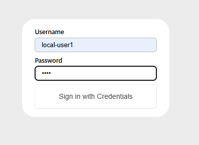
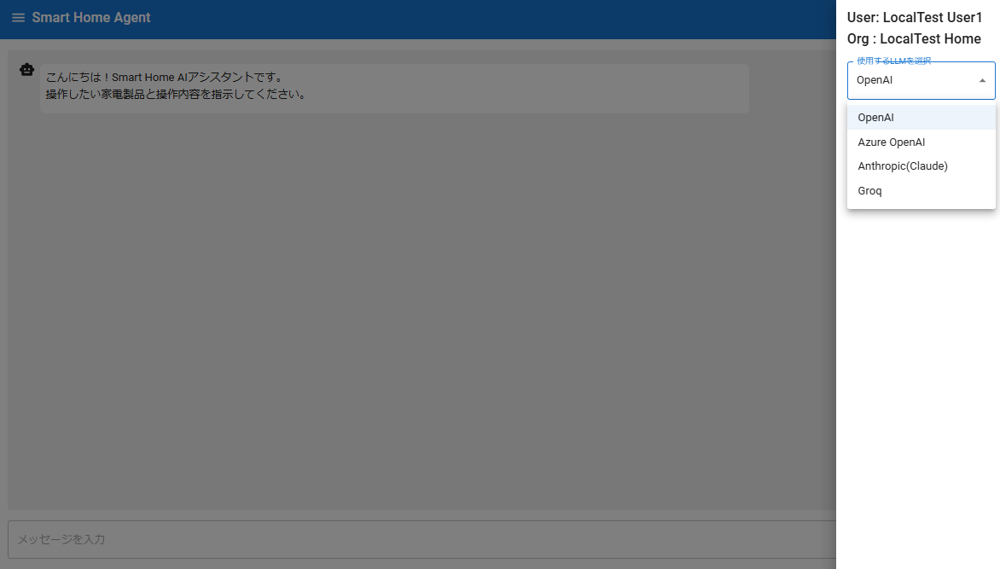
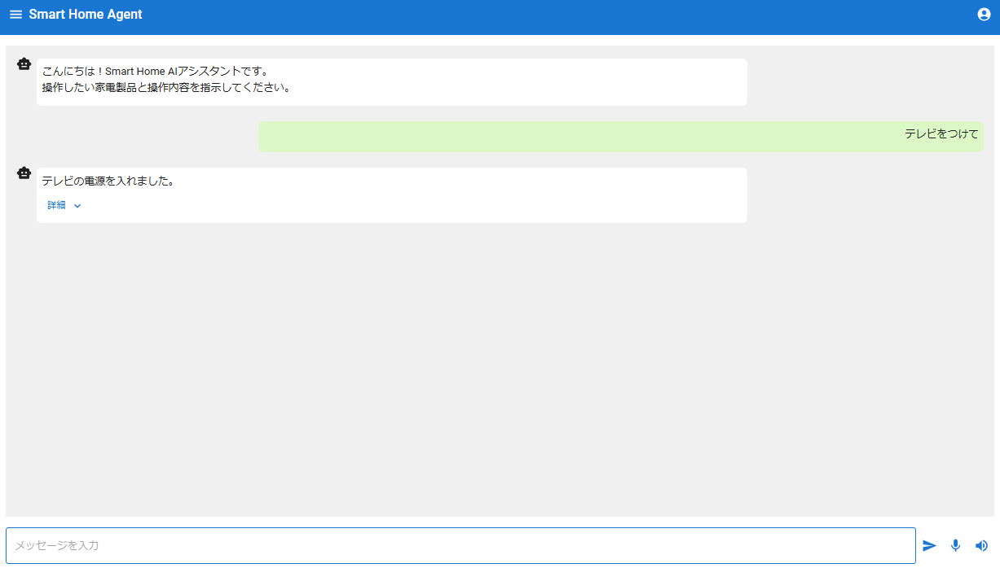

# アプリケーション概要
- Chatbot形式のホームデバイス操作エージェントアプリ
- LLMのFunction Calling API経由で、APIコントロール可能なホームデバイスと連携
- 文字起こし（Speech-to-text）、読み上げ（Text-to-speech）を使った音声チャットに対応
- 複数のLLMプロバイダから選択可能（アドオン実装も可能）

# アプリケーション仕様
## コンセプト
目的の本質でない機能（認証・認可等）は、3rd Partyライブラリを利用して実装負荷軽減しつつ、本質の機能（Function Callingを使ったホームデバイス操作）はなるべくピュアに実装することをコンセプトにしました。

## 基本仕様
- 言語・フレームワークは、`TypeScript + Next.js`で作成
- UIコンポーネントは、 `MUI（Material-UI）`を使用
- 音声入力（Speech-to-text）は、LLM APIは使用せず`react-speech-recognition`を使用

## 認証・認可
- `NextAuth.js`を使用
- 環境変数`ACCOUNT_ENV`の値（`local` or `production`）によって以下認証方式を切り分け
    - `local` の場合、ユーザ名、パスワード方式によるログイン認証
    - `production`の場合、`Amazon Cognito`と連携したOIDC方式によるログイン認証
- `ACCOUNT_ENV`の値によらず設定必須の環境変数あり（後述）
- `ACCOUNT_ENV=production`の場合、設定必須の環境変数あり（後述）
- 認証されたユーザに紐づく設定情報は以下Yamlで管理
    - `user.local.yaml`
    - `user.production.yaml`
    - `org.yaml`

### `user.local.yaml`
- `ACCOUNT_ENV=local`の場合のユーザ設定情報
- ユーザ名をKeyとして、表示名`display_name`と組織ID（後述）`organization`を設定

local認可用ユーザ管理テンプレート`user.local.yaml.template`を`user.local.yaml`にコピーしてアプリケーション実行するとユーザ名`local-user1`でログイン可能です。

```yaml: user.local.yaml
local-user1:
  display_name: "LocalTest User1"
  organization: "localtest-home"
```

> [!CAUTION]
> コードを見てもらえれば分かると思いますが、`local`の場合に入力したパスワードは検証していません。ユーザ名さえ合っていればパスワードは任意の値でログインできるようになっています。目的の本質でない所なので端折っています。予めご認識ください。

### `user.production.yaml`
- `ACCOUNT_ENV=production`の場合のユーザ設定情報
- `Amazon Cognito`で作成したユーザの`subject`の値がKey、それ以外は`local`と同じ

production認可用ユーザ管理テンプレート`user.production.yaml.template`を`user.production.yaml`にコピーしたうえで、`Amazon Cognito`で作成したユーザの`subject`の値を、TOPレベルのYamlキー（templateでは、`11111111-2222-3333-4444-abcdefghijklmn`）に設定のうえ、アプリケーション実行するとCognitoで作成したユーザでログイン可能です。

```yaml: user.production.yaml
11111111-2222-3333-4444-abcdefghijklmn:
  display_name: "ProdTest User1"
  organization: "prodtest-home"
```

#### Amazon Cognitoの事前準備が必要
`production`の場合、`Amazon Cognito`と連携した認証を行うため以下事前準備が必要です。

- AWSアカウント
- `Amazon Cognito`のユーザプールの作成、及びユーザの作成
- ユーザプール作成時に払出される、アプリケーションをCognitoと連携させるための各パラメータを環境変数に設定

### `org.yaml`
- ユーザに紐づく組織設定情報
- `user.[ACCOUNT_ENVの値].yaml`に設定した組織ID`organization`をKeyとして以下設定
    - `display_name`:   組織表示名
    - `llm_apis`:       利用する「LLMプロバイダID: プロバイダ名」のリスト
    - `translate_apis`: 利用する「翻訳APIプロバイダID: プロバイダ名」のリスト

組織管理テンプレート`org.yaml.template`を`org.yaml`にコピーすると前述`user.[ACCOUNT_ENVの値].yaml.template`の組織IDと紐づいた設定になるので、あとは必要に応じて設定変更したうえでアプリケーションを実行できます。

```yaml: org.yaml
# For localhost testing, you can use the following configuration
localtest-home:
  display_name: "LocalTest Home"
  llm_apis:
    - OpenAI: "OpenAI"
    - AzureOpenAI: "Azure OpenAI"
    - Anthropic: "Anthropic(Claude)"
    - Groq: "Groq"
  translate_apis:
    - DeepL: "DeepL"

# For production testing, you can use the following configuration
prodtest-home:
  display_name: "ProdTest Home"
  llm_apis:
    - OpenAI: "OpenAI"
    - AzureOpenAI: "Azure OpenAI"
    - Anthropic: "Anthropic(Claude)"
    - Groq: "Groq"
  translate_apis:
    - DeepL: "DeepL"
```

### 環境変数一覧（`ACCOUNT_ENV`の値によらず、必須）
| 変数名 | 内容 | Secret
| ---- | ---- | ---- |
| `ACCOUNT_ENV` | `local`または`production`を指定 ||
| `NEXTAUTH_URL` | NextAuth.jsで使用される認証Callback用のベースURL<br/>（ex. ローカル環境の場合、`http://localhost:3000`） ||
| `NEXTAUTH_SECRET` | NextAuth.jsでJWTトークン等のハッシュ化等に使用される<br/>任意の文字列でも良いが一般的には以下のようなコマンドでランダムキーを生成<br/>` openssl rand -base64 32` | 〇 |

### 環境変数一覧（`ACCOUNT_ENV=production`の場合、必須）
| 変数名 | 内容 | Secret
| ---- | ---- | ---- |
| `COGNITO_CLIENT_ID` | CognitoユーザプールのクライアントID ||
| `COGNITO_CLIENT_SECRET` | Cognitoユーザプールのクライアントシークレット |〇|
| `COGNITO_ISSUER` | CognitoユーザプールのISSUER URL<br/>（ex. `https://cognito-idp.{region}.amazonaws.com/{ユーザプールId}`） ||

## LLM API
- デフォルトでは、以下LLMプロバイダに対応
    - OpenAI（GPTモデル）
    - Azure OpenAI Service（GPTモデル）
    - Anthropic（Claudeモデル）
    - Groq（主にLlama系モデル）
- 利用したいプロバイダのみ、前述の`org.yaml`の`llm_apis`でフィルタ可能
- 他のLLMプロバイダを使いたい場合は、Adapterを作成することでアドオン可能
- 何れのプロバイダも事前にAPIキーのほか、以下パラメータを用意のうえ環境変数設定が必要

> [!NOTE]
> 現時点では、LLMプロバイダは画面UIで切り替えて利用できますが、同一LLMプロバイダ内のモデルを切り替えられる画面UIにはなっていません。
> 切り替えたい場合は、各プロバイダのモデル名の環境変数の設定値を変更してアプリケーション再起動が必要です。

> [!NOTE]
> 2024年10月時点では[Anthropic API](https://docs.anthropic.com/en/api)や[Groq Audio API](https://console.groq.com/docs/api-reference#audio)では、Text-to-speech(読み上げ)は対応していませんでした。\
> 読み上げ未対応なLLMを選択して読み上げを実行した場合は、予め用意されたSorry音声を流せるようなアプリケーション実装にしています。（Sorry音声自体は、GPTの読み上げモデル`tts-1`を使って生成した音声ファイルを使っています）

### OpenAI
(Azureでない)OpenAIのLLMについては、最低限APIキーのみで使用可能です。\
事前に、[公式のAPIサイト](https://openai.com/index/openai-api)からサインアップのうえ払出ししてください。\
（APIキーを利用するには、別途クレジットの購入も必要です）

#### 環境変数一覧
| 変数名 | 内容 | Secret
| ---- | ---- | ---- |
| `OPENAI_API_KEY` | APIキー | 〇 |
| `OPENAI_API_MODEL_CHAT` | Chat、Function Calling用モデル名<br/>（ex. `gpt-4o`） ||
| `OPENAI_API_MODEL_TEXT2SPEECH` | 読み上げ用モデル名<br/>（ex. `tts-1`） ||

### Azure OpenAI Service
事前準備として、Azureサブスクリプションを登録のうえ、[リソースの作成とモデルのディプロイ](https://learn.microsoft.com/ja-jp/azure/ai-services/openai/how-to/create-resourceが?pivots=web-portal)が必要になります。

#### 環境変数一覧
| 変数名 | 内容 | Secret
| ---- | ---- | ---- |
| `AZURE_OPENAI_API_KEY` | APIキー | 〇 |
| `AZURE_OPENAI_ENDPOINT` | APIエンドポイント<br/>（ex. `https://{xxxx}.openai.azure.com`） ||
| `OPENAI_API_VERSION` | APIバージョン<br/>（ex. `2024-08-01-preview`） ||
| `AZURE_OPENAI_API_DEPLOYMENT_CHAT` | Chat、Function Calling用ディプロイメント名 ||
| `AZURE_OPENAI_API_DEPLOYMENT_TEXT2SPEECH` | 読み上げ用ディプロイメント名 ||

### Anthropic
Anthropicも、OpenAI同様最低限APIキーのみで使用可能です。\
事前に、[公式のAPIサイト](https://console.anthropic.com)からサインアップのうえ払出ししてください。\
（OpenAI同様に、クレジットの購入も必要です）

#### 環境変数一覧
| 変数名 | 内容 | Secret
| ---- | ---- | ---- |
| `ANTHROPIC_API_KEY` | APIキー | 〇 |
| `ANTHROPIC_API_MODEL_CHAT` | Chat、Function Calling用モデル名<br/>（ex. `claude-3-5-sonnet-latest`） ||

### Groq
OpenAI APIとの互換性と高速レスポンスを強みとしているLLMプロバイダです。\
2024年10月時点では、`Llama-3.1-70B`などの高性能モデルを無料で使えます。\
https://console.groq.com/docs/models\
\
こちらもAPIキーについては[公式のAPIサイト](https://console.groq.com)からサインアップのうえ払出ししてください。

#### 環境変数一覧
| 変数名 | 内容 | Secret
| ---- | ---- | ---- |
| `GROQ_API_KEY` | APIキー | 〇 |
| `GROQ_API_MODEL_CHAT` | Chat、Function Calling用モデル名<br/>（ex. `Llama3-8b-8192`） ||

> [!CAUTION]
> 2024年10月時点では無料で使用できますが、今後利用条件が変わる可能性がありますのでご注意ください。

### 他のLLMプロバイダのアドオン実装
LLM APIとの接続部分は、各プロバイダ毎にAdapter方式で実装されているため比較的簡単にアドオン実装が可能になっています。\
\
以下、`GroqAdapter`を参考にAdapter実装の流れを説明します。

#### Adapterクラスを実装
- `/src/api/llm/`配下に、インターフェース`LlmAdapter`を実装したAdapterクラスを作成
- Adapterクラスのコンストラクタでは、APIキーやモデル名などの必要なパラメータを環境変数から取得し、APIクライアントインスタンスを生成
- `functionCalling`メソッドを、大枠以下の流れで実装
  1. 引数`systemPrompt`（LLM API向けのsystemプロンプト用メッセージ）、引数`messages`（userプロンプト用メッセージ）を元にFunction Calling用の入力プロンプト配列を生成
  2. 新message配列を含めた、Function Calling向けのOptionオブジェクトを引数`options`を元に生成
  3. 生成したOptionを指定してLLMのChat APIをコール、レスポンスから`finish_reason`を取得
  4. `finish_reason`がtool呼出し以外、つまりFunction Callingと判定されなかった場合は応答されたAssistantメッセージをそのまま応答
  5. Function Callingと判定された場合、レスポンスから対象Functionを順番に取り出して実行
    - 5-1.Function名を取得
    - 5-2. 引数`functions`から対象Function名を元に実行する`Function`オブジェクトを取得
    - 5-3. Function実行時に渡す実行引数（JSON形式）をパースして取得
    - 5-4. 取得した実行引数を指定してFunction実行
    - 5-5. Function実行結果をLLM Chat形式に整形して、1.でコピーしたmessage配列に追加
  6. 5.でFunction実行結果が追加されたmessage配列を指定して、3.と同様に再度LLMのChat APIをコール
  7. レスポンスメッセージをAssistantメッセージとして応答

- `textToSpeech`メソッドについては、プロバイダが読み上げAPI提供していない場合は、`AnthropicAdapter`を参考にSorry音声を応答、対応している場合は`OpenAIAdapter`を参考に読み上げAPIを実行した結果を応答するイメージ

```ts:/src/api/llm/groq_adapter.ts
//～～省略～～

export class GroqAdapter implements LlmAdapter {

  protected groqClient;

  constructor(
    protected llmConfig = {
      apiKey: JSON.parse(process.env.APP_SECRETS || "{}").GROQ_API_KEY || process.env.GROQ_API_KEY || "",
      apiModelChat: process.env.GROQ_API_MODEL_CHAT!,
    },
  ) {
    this.initCheck(llmConfig);
    this.groqClient = new Groq({apiKey: llmConfig.apiKey});
  };

  //～～省略～～

  async functionCalling(
    functions: { [functionId: string]: Function },
    systemPrompt: string[],
    messages: string[],
    options: FunctionCallingOptions
  ): Promise<FunctionCallingResponse> {

    // 1.
    const funcMessages: ChatCompletionMessageParam[] = [];
    systemPrompt.forEach(msg => {
      funcMessages.push({
        role: "system",
        content: msg,
      });
    });
    messages.forEach(msg => {
      funcMessages.push({
        role: "user",
        content: msg,
      });
    });
    // 2.
    const funcOtions = {
      model: this.llmConfig.apiModelChat,
      messages: funcMessages,
      tools: options.tools as ChatCompletionTool[],
      tool_choice: options.toolChoice || "auto" as ChatCompletionToolChoiceOption,
      max_tokens: options.maxTokens as number || 1028,
      temperature: options.temperature as number ?? 0.7,
      response_format: options.responseFormat,
    };
    const response: FunctionCallingResponse = {
      resAssistantMessage: "",
      resToolMessages: []
    };
    try {
      // 3.
      const chatResponse = await this.groqClient.chat.completions.create(funcOtions);
      const choice = chatResponse.choices[0];
      const finishReason = choice.finish_reason;
      // 4.
      if (finishReason !== "tool_calls") {
        response.resAssistantMessage = choice.message?.content || "Sorry, there was no response from the agent.";
        return response;
      }
      
      if (choice.message) {
        const toolMessage = choice.message;
        funcMessages.push(toolMessage);
        // 5.
        for (const toolCall of toolMessage?.tool_calls || []) {
          // 5-1.
          const functionName = toolCall.function.name;
          // 5-2.
          const functionToCall = functions[functionName];
          // 5-3.
          const functionArgs = JSON.parse(toolCall.function.arguments);
          const values = Object.values(functionArgs);
          // 5-4.
          const functionOutput = functionToCall ? await functionToCall(...values) : {error: `${functionName} is not available`};
          // 5-5.
          const content = { ...functionArgs, function_output: functionOutput };
          const resToolMessage = {
            content: JSON.stringify(content)
          };
          const toolResult = {
            tool_call_id: toolCall.id,
            role: "tool",
            ...resToolMessage
          };
          funcMessages.push(toolResult as ChatCompletionMessageParam);
          response.resToolMessages.push(resToolMessage);
        }

        funcOtions.messages = funcMessages;
        // 6.
        const nextChatResponse = await this.groqClient.chat.completions.create(funcOtions);
        // 7.
        response.resAssistantMessage = nextChatResponse.choices[0].message?.content || "Sorry, there was no response from the agent. If the following details are displayed, please check them.";
      }
    } catch (error) {
      throw error;
    }

    return response;
  }

  async textToSpeech(_: string, options: Record<string, any>): Promise<TextToSpeechResponse> {
    //～～省略～～
  }
}
```

- また、作成したAdapterクラスを`llmAdapterBuilder`の生成対象クラス一覧`llmAdapterClasses`に`[LLMプロバイダID]: [Adapterクラス名]`の形式で追加する

```ts:/src/api/llm/llm_adapter_builder.ts
//～～省略～～
const llmAdapterClasses: Record<string, LlmAdapterConstructor> = {
  OpenAI: OpenAIAdapter,
  AzureOpenAI: AzureOpenAIAdapter,
  Anthropic: AnthropicAdapter,
  Groq: GroqAdapter,
};
//～～省略～～
```


## デバイスコントロール
デフォルトでは、中継器として**SwitchBotを介したデバイス操作のみ対応**しています。\
ただし、他の中継器を使用したい場合、もしくは中継器を使わずに直接API対応しているデバイスを操作したい場合も、デフォルトのSwitchBot向けの実装コードを参考に作り込めば対応可能です。

### SwitchBotとデバイスの接続確認・デバイスIDの取得
SwitchBotは個別に用意のうえ、操作したいデバイスとの接続を確認しておく必要があります。\
なお、サンプルでは赤外線リモコンに対応したMatter対応のSwitchBotハブミニを使っています。\
https://www.switchbot.jp/pages/switchbot-hub-mini-matter

SwitchBot API利用に必要なトークンやシークレットの払出し方法は以下を参照してください。\
https://support.switch-bot.com/hc/ja/articles/12822710195351-%E3%83%88%E3%83%BC%E3%82%AF%E3%83%B3%E3%81%AE%E5%8F%96%E5%BE%97%E6%96%B9%E6%B3%95

SwitchBot API仕様は以下を参照してください。\
https://github.com/OpenWonderLabs/SwitchBotAPI

接続したデバイス情報を取得するAPIの応答メッセージから**デバイスIDを取得して控えておきます。（後続の設定で使用）**

### デバイスコントローラ（Function）の作成
デフォルトでは、サンプルとしてSwitchBotを介して赤外線リモコン登録した`TV`、`Light`向けのFunctionを用意しています。\
SwitchBotで操作できるデバイスなら、Functionを作成・設定することでアドオン可能です。\
\
以下、サンプルの`TV`を参考にアドオンの流れを説明します。

#### Function Callingのtool定義ファイルの作成
- `/funcdef/`配下にJSON形式でLLMのFunction Callingのtool定義を作成
- tool定義の仕様は、各LLMプロバイダのAPI仕様によるので確認のうえ作成が必要ですが少なくともデフォルトのプロバイダは同じ定義ファイルを共用可能
- 以下、サンプルの`TV`の定義を参考にポイントを記載
    - ファイル名と`function.name`の値は同一にする
    - `function.parameters.required`は`["commandType", "command"]`固定
    - `function.parameters.properties.commandType.description`に、操作するコマンドの種類を全て記載する
    - `function.parameters.properties.[command]`の`[command]`は重複しないようにコマンド種類ごとに定義する
    - `function.parameters.properties.[command].description`に、コマンド種類ごとのコマンドのパターンやルール・制約等を定義する

```json:/funcdef/controlTVBySwitchbot.json
{
    "type": "function",
    "function": {
        "name": "controlTVBySwitchbot",
        "description": "Control TV given command by Switchbot.",
        "parameters": {
            "type": "object",
            "properties": {
                "commandType": {
                    "type": "string",
                    "description": "The Command type to control TV. e.g. 'power', 'channel', 'volume'"
                },
                "commandOfPowerchange": {
                    "type": "string",
                    "description": "The Command to change power status. e.g. 'change', 'turnOn', 'turnOff'"
                },
                "commandOfChannelsetting": {
                    "type": "integer",
                    "description": "The Command to set channel from 1 to 12."
                },
                "commandOfVolumechange": {
                    "type": "integer",
                    "description": "The Command to change volume from -3 to 3."
                }
            },
            "required": [
                "commandType",
                "command"
            ]
        }
    }
}
```
> [!TIP]
> 上記、`/funcdef/`配下に配置するtool定義ファイルはOpenAI、及びOpenAI仕様に準拠した定義を配置していますが、AnthropicのようにOpenAI仕様に準拠していないプロバイダのtool定義についてはLLMプロバイダIDでネストした階層`/funcdef/[LLMプロバイダID]/`に同名のtool定義ファイルを配置することで適用可能にしています。（Anthropicの`TV`の定義は、`/funcdef/Anthropic/controlTVBySwitchbot.json`に配置しています）

#### Functionクラスを実装
- `/src/api/devctl/func/`配下に、SwitchBot操作用抽象クラス`SwitchbotControlClient`を継承したFunctionクラスを作成
- Functionクラスでは、`functionId`が引数のコンストラクタを用意し、且つ`functionId`はスーパークラスのコンストラクタに引数で渡す
- `controlDevice`メソッドをオーバーライドして、デバイス操作処理を実装する

```ts:/src/api/devctl/func/switchbot_tv_control_client.ts
import { SwitchbotControlClient } from "./switchbot_control_client"

export class SwitchBotTVControlClient extends SwitchbotControlClient {
  constructor(functionId: string) {
    super(functionId);
  }

  async controlDevice(commandType: string, command: string | number): Promise<Record<string, string>> {
    console.log(`[TVControlClient] command_type: ${commandType} command: ${command}`);
    const url = `${this.switchbotConfig.devCtlEndpoint}/v1.1/devices/${this.switchbotConfig.devIds.main}/commands`;
    const headers = this.getSwitchbotApiHeader();

    if (commandType === "power") {
      const response = await fetch(url, {
        method: "POST",
        headers,
        body: JSON.stringify({
          command: "turnOn",
          parameter: "default",
          commandType: "command",
        }),
      });
      if (response.status === 200) {
        return { success: "TVの電源を変更しました" };
      } else {
        return { error: "TVの電源の変更に失敗しました" };
      }
    } else if (commandType === "channel") {

        //～～省略～～

    } else {
      return { error: `command_typeが不正です. command_type=${commandType}` };
    }
  }
}
```

- また、作成したFunctionクラスを`functionBuilder`の生成対象クラス一覧`functionClasses`に追加する

```ts:/src/api/devctl/func/function_builder.ts
//～～省略～～
const functionClasses: Record<string, DeviceControlClientConstructor> = {
  SwitchBotTVControlClient,
};
//～～省略～～
```

#### FunctionとデバイスIDのJSONマップ
- 作成したFunctionクラスが、デバイスを操作する（＝操作するためのAPIを呼び出す）には前述で確認したデバイスIDが必要
- FunctionクラスがデバイスIDを参照できるように、以下JSON形式でtool定義の`function.name`とデバイスIDのマップを定義して後述の環境変数に設定
```json
{"controlTVBySwitchbot": {"[任意のKey名]": "[デバイスID]"}}
```
- これによって、Functionクラスでは`this.switchbotConfig.devIds.[Key名]`でデバイスIDが取得可能となる

#### Function定義ファイル
- `/devctl.yaml`を作成し、前述で定義済のtool定義`function.name`と、`functionClasses`に追加したFunctionクラス名をマッピング定義
- ここでマッピング定義したFunctionのみが呼出し可能となる

```yaml: devctl.yaml
controlTVBySwitchbot: SwitchBotTVControlClient
```

### 環境変数一覧（SwitchBotの場合）
アプリとSwitchBotと連携するために、前述のパラメータを以下環境変数へ設定が必要
| 変数名 | 内容 | Secret
| ---- | ---- | ---- |
| `SWITCHBOT_ENDPOINT` | APIエンドポイント<br/>通常は`https://api.switch-bot.com` ||
| `SWITCHBOT_TOKEN` | APIトークン |〇|
| `SWITCHBOT_SECRET_KEY` | シークレットキー |〇|
| `SWITCHBOT_FUNCTION_DEVICEIDS_MAP` | 前述のFunctionとデバイスIDのJSONマップ |〇|

## 翻訳 API
- 日本語でのデバイス操作リクエストに対して英語翻訳を介してLLMへプロンプト入力可能
- 英語翻訳を介するメリットは主に以下
    - 日本語でのリクエストに対して意図しないコンテンツフィルタリングへの対策
    - トークンサイズの節約＝API利用料金の節約
- デフォルトでは、`DeepL`のAdapterを使用可能（APIキーの払出しは別途必要）
- 他の翻訳APIを使いたい場合は、Adapterを作成することでアドオン可能

#### 環境変数一覧（DeepLの場合）
| 変数名 | 内容 | Secret
| ---- | ---- | ---- |
| `DEEPL_API_KEY` | APIキー | 〇 |

DeepLのAPIキーは、[公式サイト](https://www.deepl.com)でアカウント登録のうえ発行してください。

#### 他の翻訳APIのアドオン実装
LLM APIのAdapter同様に、翻訳APIもAdapterを実装することでアドオン可能です。\
LLMと同じ要領なので詳細は割愛しますが、以下の流れです。
- `/src/api/translate/`配下に、インターフェース`TranslateAdapter`を実装したAdapterクラスを作成
- Adapterクラスのコンストラクタでは、APIキーなどの必要なパラメータを環境変数から取得し、APIクライアントインスタンスを生成
- `translateText`メソッドを実装して翻訳結果を応答


# 実行手順
GitHubからリポジトリを`git clone`したうえで以下の流れで実行できます。
## 環境変数
- 前述のアプリケーション仕様で記載した、各環境変数一覧の変数を環境に合わせて設定する
  - `local`環境の場合、`.env.local.template`を`.env.local`にコピーして各環境変数を設定
  - `production`環境の場合は、ディプロイ環境に合わせて環境変数を設定

> [!CAUTION]
> 環境変数一覧で`Secret`に`〇`が付いている項目はシークレットな情報のため、信頼性のある管理機構を介した設定をお勧めします。（自己責任でお願いします）

## 実行（ローカル環境）
`node`、`npm`がインストールされている環境であれば通常のnpmコマンドで実行できます。
```sh
# 依存ライブラリインストール
npm install
# 通常起動
npm run build & npm run start
# デバッグ起動
npm run dev
```

ブラウザで`http://localhost:3000`にアクセスし、`user.local.yaml`で設定したユーザ名でログインすれば、あとはチャット形式で利用可能です。\
LLMプロバイダなどを切り替えたい場合は、右上のユーザアイコンから設定メニューを開いて変更可能です。


*ログイン画面*


*右上のユーザアイコンから設定メニューを開いて、LLMプロバイダ等を選択*


*チャット形式でホームデバイス操作をリクエスト*
